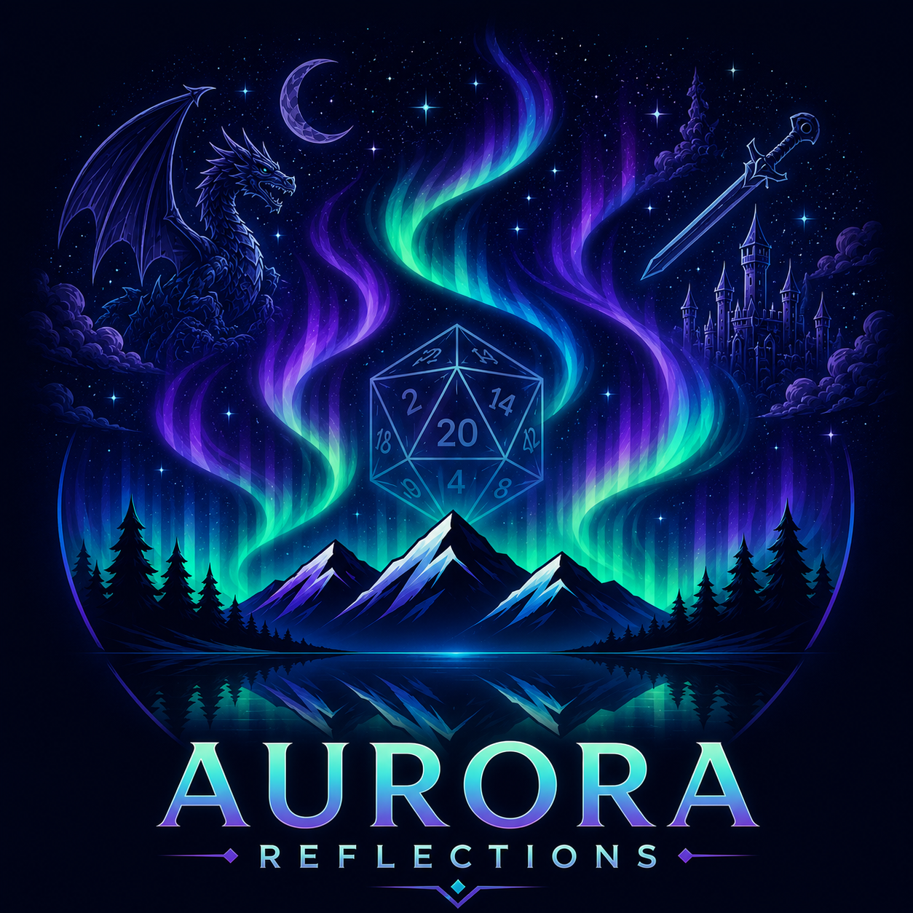

<p align="center">
  
</p>

# Aurora Lights

Aurora Lights is a community-led modernization of the legacy Aurora character
builder. Its modern client, **Aurora: Reflections**, brings Aurora content into a
new desktop experience while preserving compatibility with existing character
files and content libraries.

Aurora Lights is an open-source project developed and maintained by
[Idle Handz](https://idlehandz.com).

> [!IMPORTANT]
> Aurora: Reflections is currently a **beta preview**. Back up your character
> files before relying on it for an important session, and keep the legacy
> Aurora app available while the modern client continues to mature.

## Install Aurora: Reflections

Windows is the recommended platform for the beta preview.

1. Open the [GitHub releases page](https://github.com/Idle-Handz/Aurora-Lights/releases).
2. Download the Windows `Setup.exe` asset for your system. Most Windows PCs use
   the `win-x64` release.
3. Run the installer and launch **Aurora: Reflections**.

Windows installations created through `Setup.exe` use
[Velopack](https://velopack.io/) and can install future app updates from inside
Aurora: Reflections. Portable or extracted copies can still check for new
releases, but they cannot apply updates in place.

Mac Catalyst and Android builds are also produced by the release workflow.
Those targets are experimental and have received less hands-on testing than the
Windows build.

## What You Can Do

Aurora: Reflections currently supports the everyday character-building flow,
including:

- opening existing `.dnd5e` character files
- creating, leveling, and managing characters
- searching a SQLite-backed compendium
- managing equipment, spellcasting, and source content
- tracking session state such as hit points, spell slots, conditions, currency,
  resources, and notes
- previewing and exporting character sheets
- checking for app and content updates

The MAUI client is the active development target. Some unusual legacy files,
third-party content combinations, and advanced rules interactions may still
expose rough edges.

## Project Direction

Aurora Lights is not a single-client rewrite. It is an umbrella project for
keeping Aurora useful today while exploring ways to carry it forward.

- **Aurora: Reflections** (`Aurora.App`) is the primary current focus: a modern
  MAUI client with a new interface and a gradual migration path for legacy
  Aurora users.
- **Aurora.Web** is an early step toward a fully online character builder. It
  currently explores browser-hosted Aurora workflows while sharing compatible
  logic and UI where practical.
- **Aurora.Lights** is the legacy-facing desktop client. It aims to keep the
  familiar Aurora program alive and fully functional while moving it onto
  updated frameworks.

Contributors do not need to work on Reflections or the web client to make a
useful contribution. Small features, bug fixes, and troubleshooting work based
on the legacy application remain welcome, particularly when they improve the
shared compatibility layer for every client.

## Bring Existing Characters And Content

On Windows, Aurora: Reflections defaults to the same
`Documents\5e Character Builder` directory used by the legacy Aurora app.
Existing `.dnd5e` character files and custom XML content should appear in place;
you do not need to import or convert them.

If your legacy Aurora installation uses a different storage root:

1. Open **Settings > General > Character Storage**.
2. Select the directory that contains your existing `.dnd5e` files and
   `custom` folder.
3. Open **Settings > Content > Data**.
4. Click **Sync Now**, then close any open character tabs and click
   **Reload Elements**.

Aurora: Reflections creates `custom\aurora-elements.sqlite` as a cache for its
modern content pipeline. Your XML files remain the source of truth, and the
SQLite cache can be rebuilt from them.

## Legacy Aurora Compatibility

Aurora: Reflections is designed to coexist with the legacy Aurora application
and reuse the same character and content directory. This makes a gradual
migration possible, but the two applications do not merge concurrent edits.

For the smoothest beta experience:

- back up the entire `5e Character Builder` directory before your first beta
  session and before major content changes
- avoid editing the same character in both applications at the same time
- avoid running a legacy content update while Aurora: Reflections is syncing or
  reloading content
- close any open character tabs before reloading or rebuilding content
- use **Settings > Content** to review the active content directory and sync the
  SQLite database after content changes

The legacy WPF application remains in this repository as a parallel client.
Aurora: Reflections is intended to provide a gradual migration path rather than
an abrupt replacement.

## Known Limitations

- Windows is the recommended beta-preview platform. Mac Catalyst and Android
  builds remain experimental.
- Concurrent edits to the same character are not merged. The last application
  to save a `.dnd5e` file wins.
- Some unusual legacy character files, third-party content combinations, and
  advanced rules interactions may still expose compatibility gaps.
- After changing XML content, sync the SQLite database and reload elements
  before opening characters that depend on those changes.

## Report A Bug

Beta feedback is welcome. Please use the
[GitHub issue tracker](https://github.com/Idle-Handz/Aurora-Lights/issues) and
include:

- the Aurora: Reflections version
- the platform you were using
- a short set of reproduction steps
- a Console screenshot when an error is visible
- the affected `.dnd5e` character file when it is safe to share

## Project Layout

- `Aurora.App`
  MAUI Blazor Hybrid host for Aurora: Reflections. This is the primary modern
  desktop and mobile client.

- `Aurora.Components`
  Shared Razor components used across modern clients.

- `Aurora.Logic`
  Shared rules, models, content handling, and compatibility behavior.

- `Aurora.Importer`
  SQLite content importer used by the modern content pipeline.

- `Aurora.Web`
  Early browser-hosted Aurora experiment and first step toward a fully online
  builder.

- `Aurora.Lights`
  Legacy-facing WPF desktop client retained as a familiar, fully functional
  Aurora experience on updated frameworks.

## Development

The repository uses .NET 10. Useful project-level build commands:

```powershell
dotnet build .\Aurora.Logic\Aurora.Logic.csproj -v minimal
dotnet build .\Aurora.App\Aurora.App.csproj -v minimal -f net10.0-windows10.0.19041.0
dotnet build .\Aurora.Web\Aurora.Web.csproj -v minimal
dotnet build .\Aurora.Lights\Aurora.Lights.csproj -v minimal
```

On Windows, use the explicit Reflections framework shown above. A solution-wide
build also attempts the Android and Mac Catalyst targets and requires their
platform workloads.

Additional technical documentation:

- [Contributor guide](CONTRIBUTING.md)
- [Client feature comparison](docs/CLIENT_FEATURE_COMPARISON.md)
- [Aurora.App README](Aurora.App/README.md)
- [Aurora.Logic README](Aurora.Logic/README.md)
- [Project roadmap](docs/ROADMAP.md)

## Support Aurora Lights

If Aurora Lights has been useful to you and you would like to support ongoing
development, consider supporting the project through Patreon or Ko-fi.

- [Patreon](https://patreon.com/IdleHandz)
- [Ko-fi](https://ko-fi.com/idlehandz)

Support helps fund Aurora Lights as well as other community, creator, and
technology projects developed under the Idle Handz banner.

## About Idle Handz

[Idle Handz](https://idlehandz.com) is a community-focused creator brand
dedicated to helping people discover hobbies, events, fandoms, and the
communities surrounding them.

## License

Aurora Lights is available under the [MIT License](LICENSE).
